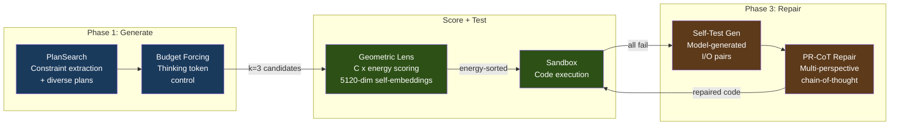

# A.T.L.A.S

**Adaptive Test-time Learning and Autonomous Specialization**

A.T.L.A.S achieves **74.6% LiveCodeBench pass@1** with a frozen 14B model on a single consumer GPU -- up from 36-41% in V2 -- through constraint-driven generation and self-verified iterative refinement. No fine-tuning, no API calls, no cloud -- just a $500 GPU and smart inference.

The premise is simple: wrap a frozen smaller model in intelligent infrastructure -- structured generation, energy-based verification, self-verified repair -- and it can compete with frontier API models at a fraction of the cost. ATLAS is fully self-hosted. No data leaves the machine, no API keys required, no usage metering. One GPU, one box.

---

## Benchmark Results

> Hardware: RTX 5060 Ti 16GB | Model: Qwen3-14B-Q4_K_M (frozen)

| Benchmark | Score | Tasks | Method |
|-----------|-------|-------|--------|
| **LiveCodeBench v5** | **74.6% pass@1*** | 599 | V3 pipeline: PlanSearch + self-verified PR-CoT repair, V3 Score |
| **GPQA Diamond** | **47.0%** | 198 | k=5, multiple-choice knowledge reasoning, V2 Score |
| **SciCode** | **14.7%** (sub-problems) | 341 | k=1, cross-domain scientific coding, V2 Score |

\*pass@1 = one solution submitted per task, but generated via best-of-3 candidates + Lens selection + iterative repair on failures. Not single-shot generation. See [methodology](docs/V3_ABLATION_STUDY.md#2-methodology).

<details>
<summary><b>V3 ablation breakdown</b></summary>

| Condition | Configuration | Pass Rate | Delta |
|-----------|---------------|-----------|-------|
| A | Baseline (no V3) | 54.9% | -- |
| B | +Phase 1 (PlanSearch + BudgetForcing + DivSampling) | 67.3% | +12.4pp |
| C | +Phase 1+2 (Lens routing) | 67.3% | +0.0pp |
| D | +Phase 1+3 (self-verified refinement) | **74.6%** | +7.3pp |

Phase 3 uses self-generated test cases for internal verification -- the model never sees the answer key during repair. PR-CoT rescues 36/42 tasks (85.7% of Phase 3 rescues). Full report: [V3_ABLATION_STUDY.md](docs/V3_ABLATION_STUDY.md)

</details>

### Cost and Performance Context

| System | LCB pass@1 | Est. cost/task | Notes |
|--------|-----------|----------------|-------|
| DeepSeek V3.2 Reasoning | 86.2% | ~$0.002 | API, single-shot |
| GPT-5 (high) | 84.6% | ~$0.043 | API, single-shot |
| **ATLAS V3 (this work)** | **74.6%** | **~$0.004** | Local electricity only, best-of-3 + repair pipeline |
| Claude 4.5 Sonnet | 71.4% | ~$0.066 | API, single-shot |
| Claude 4 Sonnet | 65.5% | ~$0.066 | API, single-shot |

> **Methodology notes:** ATLAS scores are from 599 LCB tasks using the full V3 pipeline (best-of-3 + Lens selection + iterative repair) on a frozen 14B quantized model. Competitor scores are single-shot pass@1 (zero-shot, temperature 0) from [Artificial Analysis](https://artificialanalysis.ai/evaluations/livecodebench) on 315 LCB problems -- not the same task set, so this is not a controlled head-to-head. API costs assume ~2,000 input + ~4,000 output tokens per task at current pricing. ATLAS cost = electricity at $0.12/kWh (~165W GPU, ~1h 55m for 599 tasks). ATLAS trades latency for cost -- the pipeline takes longer per task than a single API call, but no data leaves the machine.
>
> **Sources:** [Artificial Analysis LCB Leaderboard](https://artificialanalysis.ai/evaluations/livecodebench) | [AA Benchmarking Methodology](https://artificialanalysis.ai/methodology/intelligence-benchmarking) | [LiveCodeBench Paper (arXiv)](https://arxiv.org/abs/2403.07974) | [LCB Dataset (HuggingFace)](https://huggingface.co/datasets/livecodebench/code_generation_lite) | Pricing: [OpenAI](https://openai.com/api/pricing/), [Anthropic](https://docs.anthropic.com/en/docs/about-claude/models/overview), [DeepSeek](https://api-docs.deepseek.com/quick_start/pricing)

---

## How It Works



A single patched llama-server runs on K3s, providing both generation with speculative decoding (~100 tok/s) and 5120-dim self-embeddings for Lens scoring. The **Geometric Lens** C(x) energy field selects the best candidate (87.8% accuracy on mixed-result tasks). Failed tasks enter Phase 3, where the model generates its own test cases and iteratively repairs solutions via PR-CoT -- real tests are used only for final scoring.

Full architecture: **[docs/ARCHITECTURE.md](docs/ARCHITECTURE.md)**

---

## Quick Start

> **Before you begin:** ATLAS was developed and tested on specific hardware. Read the [Reproduction](#reproduction) section below to check compatibility and tune variables for your setup before running.

```bash
git clone https://github.com/itigges22/ATLAS.git && cd ATLAS

cp atlas.conf.example atlas.conf    # set MODEL_PATH, DATA_DIR, GPU device
sudo ./scripts/install.sh
./scripts/verify-install.sh

# Run V3 benchmark
python3 benchmark/v3_runner.py
```

See **[docs/SETUP.md](docs/SETUP.md)** for full installation instructions.

---

## Reproduction

V3 results were produced on RHEL 9 running as a Proxmox VM with an RTX 5060 Ti 16GB passed through via VFIO. Other NVIDIA GPUs with 16GB+ VRAM should work, though you may need to adjust driver versions and VRAM allocation.

The pipeline is not yet plug-and-play on arbitrary hardware -- V3.1 will improve portability. That said, Claude Code can be used to retrofit the pipeline to your specific setup (different GPU, OS, VRAM budget).

Key variables to tune for your hardware:
- `--parallel` slots (default 2 -- reduce to 1 if VRAM is tight)
- KV cache quantization (Q4_0 -- see [ARCHITECTURE.md](docs/ARCHITECTURE.md) for VRAM breakdown)
- Context per slot (default 20480 tokens)
- CUDA driver version (tested on CUDA 12.8)

Full VRAM budget breakdown is documented in [docs/ARCHITECTURE.md](docs/ARCHITECTURE.md). Community reproduction attempts are welcome -- open an issue with your hardware config and results.

---

## Hardware Requirements

| Resource | Minimum | Tested |
|----------|---------|--------|
| GPU VRAM | 16 GB | RTX 5060 Ti 16 GB |
| System RAM | 14 GB | 16 GB |
| Python | 3.10+ | 3.11 |
| OS | RHEL 9 / Ubuntu 24 | RHEL 9 (Proxmox VM) |

---

## Project Structure

```
benchmark/       Benchmark suite (V2 runner, V3 pipeline, datasets)
benchmark/v3/    V3 subsystems (16 modules: PlanSearch, BudgetForcing, PR-CoT, etc.)
rag-api/         Core API: Geometric Lens, confidence router, RAG, cache
llama-server/    Patched llama.cpp server (spec decode + self-embeddings)
manifests/       K3s deployment manifests
scripts/         Installation and management scripts
tests/           Test suite (infrastructure, integration, V3)
docs/            Architecture, setup, configuration, troubleshooting
api-portal/      API key management portal (JWT auth, web UI)
sandbox/         Isolated code execution environment
```

---

## Documentation

| Document | Description |
|----------|-------------|
| **[ARCHITECTURE.md](docs/ARCHITECTURE.md)** | System architecture, component deep-dives, data flows |
| **[V3_ABLATION_STUDY.md](docs/V3_ABLATION_STUDY.md)** | V3 ablation results and phase contribution analysis |
| **[SETUP.md](docs/SETUP.md)** | Installation and deployment guide |
| **[CONFIGURATION.md](docs/CONFIGURATION.md)** | Configuration reference (including all V3 toggles) |
| **[TROUBLESHOOTING.md](docs/TROUBLESHOOTING.md)** | Common issues and solutions |
| **[API.md](docs/API.md)** | API endpoint documentation |

<details>
<summary><b>Historical documentation</b></summary>

| Document | Description |
|----------|-------------|
| **[V2_5_ABLATION_STUDY.md](docs/V2_5_ABLATION_STUDY.md)** | V2.5 Geometric Lens ablation (embedding source discovery) |
| **[V2_TO_V2_5_MIGRATION.md](docs/V2_TO_V2_5_MIGRATION.md)** | V2 to V2.5 two-server sidecar migration and V3 restoration |

</details>

---

## Roadmap

### V3.0 -- Complete (2026-03-05)

74.6% LCB pass@1 on frozen Qwen3-14B-Q4_K_M. PlanSearch + BudgetForcing + Geometric Lens + PR-CoT repair pipeline. [Full ablation report](docs/V3_ABLATION_STUDY.md).

### Known Limitations

These are actively being addressed in V3.1:

1. **LCB-only optimization.** V3 phases were designed and tuned for LiveCodeBench. GPQA Diamond (47.0%) and SciCode (14.7%) results are included but those benchmarks were not optimized for. Cross-domain generalization is a V3.1 priority.

2. **Phase 2 (Geometric Lens routing) contributed +0.0pp.** C(x) was retrained on self-embeddings for V3 (fixing the V2 nomic embedding failure), but the training dataset was only ~60 samples -- far too small to learn a meaningful energy landscape. With an undertrained C(x), the Lens cannot discriminate candidates during routing. V3.1 retrains C(x) on a properly sized dataset drawn from real benchmark problems.

3. **G(x) metric tensor is dormant.** G(x) is downstream of C(x): it applies metric corrections to C(x)'s gradient signal. With C(x) undertrained and producing a weak/noisy energy landscape, G(x) has no meaningful geometry to navigate -- the correction term Δx = -G⁻¹∇C contributes nothing. G(x) is currently being redesigned from the ground up; V3.1 will either ship a working redesign or remove it entirely pending further research.

4. **Single-threaded task pipeline.** Tasks are processed sequentially. V3.1 adds task-level parallelization to improve benchmark throughput.

5. **SandboxAdapter stdio bug.** S\* distinguishing input tiebreaking is implemented but non-functional on LCB tasks due to a stdio handling bug in the SandboxAdapter. Fixed in V3.1.

### V3.1 -- In Progress

- **Model swap**: Qwen3-14B → Qwen3.5-9B with DeltaNet linear attention architecture. Native multi-token prediction (MTP) gives ~3-4x throughput improvement at comparable or better accuracy. Smaller model also frees VRAM headroom.
- **Lens Evolution**: Online C(x) recalibration -- Geometric Lens updates based on benchmark feedback rather than remaining static after initial training.
- **Phase 2 redesign**: Retrain C(x) on a properly sized self-embedding dataset, remove or redesign G(x), fix SandboxAdapter stdio bug.
- **Task parallelization**: Parallel task execution for faster benchmark runs.
- **Broader benchmark suite**: See below.

### V3.1 Benchmark Suite

V3 was evaluated only on LiveCodeBench v5. V3.1 expands evaluation to cover coding, reasoning, and general knowledge -- because ATLAS is not purely a coding system. The Confidence Router allocates compute based on task difficulty: simple knowledge questions route to raw inference + RAG (~30 seconds per response), while hard coding problems use the full V3 pipeline (PlanSearch + best-of-3 + PR-CoT repair), which can take up to 20 minutes per task. The benchmark suite should reflect this full range.

**Coding benchmarks (primary):**
- LiveCodeBench v5 -- 599 problems, contamination-resistant, primary benchmark (done in V3)
- SciCode -- cross-domain scientific coding, run in V2 (14.7% sub-problems), needs V3 re-evaluation
- Additional contamination-resistant coding benchmarks as they emerge

**Reasoning and knowledge benchmarks (from Artificial Analysis Intelligence Index):**
- GPQA Diamond -- scientific reasoning, run in V2 (47.0%), needs V3 re-evaluation under full pipeline
- AA-LCR (Long Context Reasoning) -- tests reasoning over extended context, relevant given 20480-token per-slot context window
- AA-Omniscience -- knowledge accuracy and hallucination rate; important for general-purpose use cases where users ask factual questions rather than coding problems
- Humanity's Last Exam -- extreme reasoning and knowledge, useful as a ceiling test
- CritPt -- physics reasoning, tests cross-domain generalization beyond software

General knowledge benchmarks matter because ATLAS is designed as a general-purpose self-hosted AI system, not a coding-only tool. The Confidence Router handles this by routing knowledge queries directly to raw inference + RAG (~30s), while reserving the full pipeline for hard coding problems (~20min). Benchmarks like AA-Omniscience and Humanity's Last Exam validate the fast-path routing, not the coding pipeline.

**None of these V3.1 benchmarks have been run yet.** This section is forward-looking roadmap only.

Target: 80-90% LCB pass@1 with faster per-task throughput.

---

## License

Licensed under the A.T.L.A.S Source Available License v1.0 -- see [LICENSE](LICENSE).
