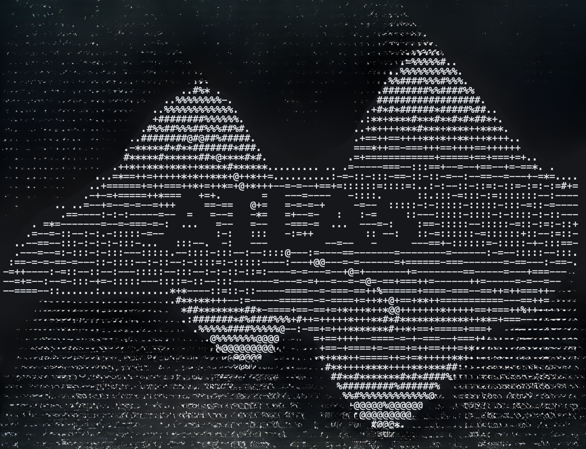
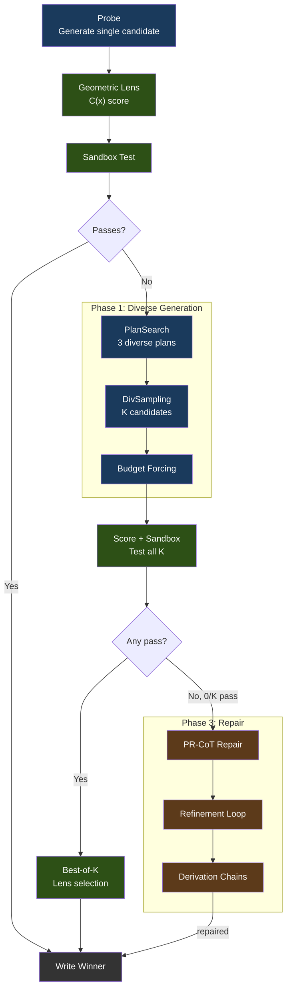

<p align="center">
  
</p>

<p align="center">
  
  
  
  
</p>

<h1 align="center">A.T.L.A.S.</h1>
<p align="center"><b>Adaptive Test-time Learning and Autonomous Specialization</b></p>

A.T.L.A.S achieves **74.6% LiveCodeBench pass@1-v(k=3)** with a frozen 14B model on a single consumer GPU — up from 36-41% in V2 — through constraint-driven generation and self-verified iterative refinement. The premise: wrap a frozen smaller model in intelligent infrastructure — structured generation, energy-based verification, self-verified repair — and it can compete with frontier API models at a fraction of the cost. No fine-tuning, no API calls, no cloud. Fully self-hosted — no data leaves the machine, no API keys required, no usage metering. One GPU, one box.

---

**V3.0.1** ships ATLAS as an **interactive coding assistant powered by a local 9B model** that you can download and use today. The 9B model (Qwen3.5-9B) has not yet been formally benchmarked under the V3 pipeline — that is V3.1 work — but the V3 pipeline architecture is identical to what scored 74.6% on the 14B model, and the 9B model's published baselines suggest it should score similarly or higher. Type `atlas` in any project directory and start building.

<p align="center">
  
</p>

---

## Why ATLAS Exists

I'm a business student at Virginia Tech. My background is in marketing, not computer science. I'm a hobbyist who got curious about what's possible when you stop assuming only the biggest players can build meaningful things.

My twin sister was born with Loeys-Dietz syndrome. When we were five, doctors told my parents she would never walk. A year later, she walked into that same doctor's office. She remembered looking back at him and seeing tears in his eyes. She passed away last year on March 29th. But that memory stayed with me. The people who tell you what's impossible are usually just describing the limits of their own experience. Sometimes all it takes is a single moment to realize the barrier was never technical — it was assumption.

ATLAS isn't the destination. It's proof of what we can build.

---

## Download and Use It

```bash
# Clone
git clone https://github.com/itigges22/ATLAS.git && cd ATLAS

# Download model weights (~7GB)
mkdir -p models && cd models
# Download Qwen3.5-9B-Q6_K.gguf from HuggingFace
cd ..

# Configure and start
cp .env.example .env        # Edit: set ATLAS_MODELS_DIR
podman-compose up -d         # or: docker compose up -d

# Start coding
atlas
```

That's it. Five commands. ATLAS starts all services, connects to the model, and drops you into an interactive coding session. Ask it to build anything.

See [docs/SETUP.md](docs/SETUP.md) for detailed setup (Docker, bare-metal, K3s).

---

## Benchmark Results

> Hardware: RTX 5060 Ti 16GB | Model: Qwen3-14B-Q4_K_M (frozen)

| Benchmark | Score | Tasks | Method |
|-----------|-------|-------|--------|
| **LiveCodeBench v5** | **74.6% pass@1-v(k=3)*** | 599 | V3 pipeline: PlanSearch + self-verified PR-CoT repair, **V3 Score** |
| **GPQA Diamond** | **47.0%** | 198 | k=5, multiple-choice knowledge reasoning, **V2 Score** |
| **SciCode** | **14.7%** (sub-problems) | 341 | k=1, cross-domain scientific coding, **V2 Score** |

\*pass@1-v(k=3) = one solution submitted per task, but generated via best-of-3 candidates + Lens selection + iterative repair on failures. Not single-shot generation — it is not pass@1. See [methodology](docs/V3_ABLATION_STUDY.md#2-methodology).

> **Important**: Only LiveCodeBench was tested on V3 infrastructure. GPQA Diamond and SciCode scores are from V2 — they were not optimized for and perform accordingly. The CLI currently runs **Qwen3.5-9B** (V3.0.1). Formal benchmarks on the 9B model have not yet been run — that is V3.1 work.

<details>
<summary><b>V3 ablation breakdown (Qwen3-14B)</b></summary>

| Condition | Configuration | Pass Rate | Delta |
|-----------|---------------|-----------|-------|
| A | Baseline (no V3) | 54.9% | — |
| B | +Phase 1 (PlanSearch + BudgetForcing + DivSampling) | 67.3% | +12.4pp |
| C | +Phase 1+2 (Lens routing) | 67.3% | +0.0pp |
| D | +Phase 1+3 (self-verified refinement) | **74.6%** | +7.3pp |

Phase 3 uses self-generated test cases for internal verification — the model never sees the answer key during repair. PR-CoT rescues 36/42 tasks (85.7% of Phase 3 rescues). Full report: [V3_ABLATION_STUDY.md](docs/V3_ABLATION_STUDY.md)

Raw ablation data: [`v3_ablation_results/`](v3_ablation_results/) | Full traces: [HuggingFace](https://huggingface.co/datasets/itigges22/ATLAS)

</details>

### Cost and Performance Context

| System | LCB pass@1 | Est. cost/task | Notes |
|--------|-----------|----------------|-------|
| DeepSeek V3.2 Reasoning | 86.2% | ~$0.002 | API, single-shot (low cost due to aggressive pricing strategy) |
| GPT-5 (high) | 84.6% | ~$0.043 | API, single-shot |
| **ATLAS V3 (pass@1-v(k=3))** | **74.6%** | **~$0.004** | **Local electricity only, best-of-3 + repair pipeline** |
| Claude 4.5 Sonnet | 71.4% | ~$0.066 | API, single-shot |
| Claude 4 Sonnet | 65.5% | ~$0.066 | API, single-shot |

> DeepSeek's cost is lower than ATLAS despite being an API because DeepSeek operates at subsidized pricing — their per-token costs are significantly below market rate as a growth strategy. ATLAS's cost is pure electricity (~$0.12/kWh × 165W GPU × 1h 55m for 599 tasks). ATLAS trades latency for privacy — no data leaves the machine.

<details>
<summary><b>Methodology notes & sources</b></summary>

ATLAS scores are from 599 LCB tasks using the full V3 pipeline (best-of-3 + Lens selection + iterative repair) on a frozen 14B quantized model — "pass@1-v(k=3)". Competitor scores are single-shot pass@1 (zero-shot, temperature 0) from Artificial Analysis on 315 LCB problems — not the same task set, so this is not a controlled head-to-head. API costs assume ~2,000 input + ~4,000 output tokens per task at current pricing. ATLAS trades latency for cost — the pipeline takes longer per task than a single API call, but no data leaves the machine.

Sources: [Artificial Analysis LCB Leaderboard](https://artificialanalysis.ai/leaderboards/live-code-bench) | [LiveCodeBench Paper (arXiv)](https://arxiv.org/abs/2403.07974) | [LCB Dataset (HuggingFace)](https://huggingface.co/datasets/livecodebench/code_generation_lite)

</details>

<details>
<summary><b>CLI Reliability (Qwen3.5-9B, V3.0.1)</b></summary>

The interactive CLI has been validated across 8 difficulty levels × 3 iterations:

| Test | Description | Pass Rate |
|------|-------------|-----------|
| L1 | Conversational response | 100% |
| L2 | Create snake game (curses) | 100% |
| L3 | Fix broken collision detection | 100% |
| L4 | Add persistent high scores | 100% |
| L5 | Create multi-file Next.js project | 100% |
| L6 | Add JWT auth to existing project | 67% |
| L7 | Delete files from project | 100% |
| L8 | Lint and fix TypeScript errors | 100% |
| | **Overall** | **95.8%** |

5-language integration: Python, Rust, Go, C, Shell — **all pass** (compile + run).

</details>

Full training data and benchmark traces: [ATLAS Dataset on HuggingFace](https://huggingface.co/datasets/itigges22/ATLAS)

---

## How It Works



**The model writes code. The infrastructure makes it reliable.**

The ATLAS CLI wraps this pipeline in a **tool-call agent loop**. The model emits structured JSON tool calls (`write_file`, `edit_file`, `run_command`, etc.) with grammar enforcement guaranteeing 100% valid output. Feature files with complex logic (T2) automatically route through the V3 pipeline for diverse candidate generation, build verification, and energy-based selection. Config files and boilerplate (T1) skip the pipeline for instant writes.

Full architecture: [docs/ARCHITECTURE.md](docs/ARCHITECTURE.md)

---

## Hardware Requirements

| Resource | Minimum | Tested |
|----------|---------|--------|
| GPU VRAM | 16 GB | RTX 5060 Ti 16 GB |
| System RAM | 14 GB | 16 GB |
| Disk | 20 GB free | For model weights + containers |
| Python | 3.10+ | 3.11 |
| OS | Linux (RHEL, Ubuntu, Arch) | RHEL 9 |

---

## Known Limitations

These are actively being addressed in V3.1:

- **9B model not yet formally benchmarked.** The 74.6% result was achieved on Qwen3-14B. The CLI runs Qwen3.5-9B with the same V3 pipeline — formal LCB benchmarks on the 9B model are V3.1 work.
- **GPQA and SciCode scores are from V2.** V3 phases were not designed specifically for any single benchmark — they are general-purpose code generation improvements. GPQA (47.0%) and SciCode (14.7%) were tested on V2 infrastructure only. Cross-benchmark evaluation is a V3.1 priority.
- **L6 reliability at 67%.** Adding features to existing projects fails ~1/3 of the time — the 9B model sometimes over-explores instead of writing code. Exploration budget and context injection mitigate but don't fully solve this.
- **Inference speed.** Grammar-constrained output runs at ~51 tok/s on llama-server. Fox (with PagedAttention and prefix caching) achieves only 14 tok/s with grammar due to Tokio async overhead. C-side sampler chain fix planned for V3.1.

---

## Documentation

| Document | Description |
|----------|-------------|
| **[SETUP.md](docs/SETUP.md)** | Installation — Docker, bare-metal, K3s |
| **[CLI.md](docs/CLI.md)** | CLI usage, streaming output, getting best results |
| **[TROUBLESHOOTING.md](docs/TROUBLESHOOTING.md)** | Common issues and solutions |
| **[ARCHITECTURE.md](docs/ARCHITECTURE.md)** | Two-layer architecture, component design |
| **[CONFIGURATION.md](docs/CONFIGURATION.md)** | All environment variables and config |
| **[API.md](docs/API.md)** | HTTP API endpoints and formats |
| **[MAP.md](docs/MAP.md)** | Visual guide to every file in the repo |
| **[V3_ABLATION_STUDY.md](docs/V3_ABLATION_STUDY.md)** | Ablation methodology and results |
| **[CHANGELOG.md](CHANGELOG.md)** | Release history |

<details>
<summary><b>Historical documentation</b></summary>

| Document | Description |
|----------|-------------|
| **[V2_5_ABLATION_STUDY.md](docs/V2_5_ABLATION_STUDY.md)** | V2.5 Geometric Lens ablation |
| **[V2_TO_V2_5_MIGRATION.md](docs/V2_TO_V2_5_MIGRATION.md)** | V2 to V2.5 migration |

</details>

For a complete guide to every directory and file, see **[docs/MAP.md](docs/MAP.md)**.

---

## Roadmap

**V3.0** — Complete (2026-03-05). 74.6% LCB pass@1-v(k=3) on frozen Qwen3-14B. [Full ablation report](docs/V3_ABLATION_STUDY.md).

**V3.0.1** — Complete (2026-04-05). Interactive CLI with tool-call agent loop, Docker Compose deployment, V3 pipeline integration, 95.8% reliability. **This is the current release.**

**V3.1** — In Progress.
- **Benchmarks** (not yet run): LiveCodeBench v5 on Qwen3.5-9B with CLI pipeline, GPQA Diamond, SciCode, AA-LCR, AA-Omniscience, Humanity's Last Exam, CritPt
- **CLI reliability testing**: Expand 8-level test to 10 iterations, target L6 ≥ 90%
- **Fox optimization**: C-side sampler chain for grammar speed (14→50 tok/s target)
- **Geometric Lens**: Further improving Geometric Lens datasets through V3.1 full-suite benchmark data
- **Target**: 80-90% LCB pass@1-v(k=3)

---

## Star History

<a href="https://www.star-history.com/?repos=itigges22%2FATLAS&type=date&legend=top-left">
 <picture>
   <source media="(prefers-color-scheme: dark)" srcset="https://api.star-history.com/chart?repos=itigges22/ATLAS&type=date&theme=dark&legend=top-left" />
   <source media="(prefers-color-scheme: light)" srcset="https://api.star-history.com/chart?repos=itigges22/ATLAS&type=date&legend=top-left" />
   
 </picture>
</a>

---

## License

Licensed under the [A.T.L.A.S Source Available License v1.0](LICENSE).

## Contributing

See [CONTRIBUTING.md](CONTRIBUTING.md).
