# ATLAS Architecture

System architecture for ATLAS V3.1.0. Two-layer design: an outer agent loop handles tool-call orchestration, and an inner V3 pipeline generates diverse code candidates with build verification and energy-based selection.

---

## 1. System Overview

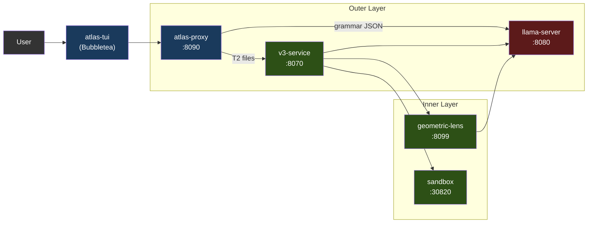

Services run as containers via Docker Compose (recommended) or as local processes via the `atlas` launcher. Only llama-server uses the GPU. Everything else runs on CPU.

The chat front-end is the **atlas-tui** (Bubbletea, PC-062): a native Go terminal UI consuming `/v1/agent` (per-turn chat SSE) and `/events` (global typed-envelope feed for the pipeline pane). Launch with `atlas` (interactive default) or `atlas tui` (explicit). Pipeline pane shows V3 stages live; chat pane renders assistant markdown via glamour; slash commands `/add /diff /commit /run` etc. handle local file context and shell-out. Mode-aware input (chat / `!bash` / `/slash`) with a hint dropdown.

`/v1/chat/completions` on the proxy is a transparent passthrough to llama-server — kept for SDK compatibility but it does not run the agent loop. Third-party clients that want tool calls + V3 pipeline should target `/v1/agent` directly. The contract is documented in [API.md](API.md); PC-063 tracks producing a fully-worked recipe and OpenAPI spec.

### 1.1 Supported Accelerators

llama-server is the only GPU-using service; every other ATLAS service runs on CPU (proxy is Go, v3-service / geometric-lens / sandbox are Python). That keeps the multi-backend surface small — adding a new accelerator means a new Dockerfile + an entrypoint env-var branch, not changes to the pipeline.

| Backend | Status (V3.1.x) | Image / build path | Compose override | Tested cards |
|---|---|---|---|---|
| **CUDA** (NVIDIA) | Shipping since V3.1.0 | `inference/Dockerfile.v31` → `atlas-llama` | (default) | RTX 5060 Ti 16GB (canonical), RTX 30xx/40xx/50xx |
| **ROCm / HIP** (AMD) | Shipping V3.1.1 | `inference/Dockerfile.rocm` → `atlas-llama-rocm` | `docker-compose.rocm.yml` | RX 7900 XTX (community smoke-test, GH #26) |
| **Metal** (Apple Silicon) | V3.1.2 planned | Native install only — no Docker (macOS can't passthrough GPU to containers) | n/a | M-series with ≥24 GB unified memory |
| **SYCL** (Intel Arc) | Roadmap | TBD | TBD | Arc A770 16 GB (target) |

**Backend selection happens at install time, not runtime.** `atlas init` runs `tier.detect_gpu()` (see `atlas/cli/commands/tier.py`), picks the largest-VRAM GPU across all detected vendors (override with `ATLAS_GPU_VENDOR` / `ATLAS_GPU_INDEX`), and writes `ATLAS_BACKEND={cuda|rocm|metal|sycl}` into `.env`. Each backend has its own pre-built image; users don't run a fat image that ships every backend's libraries. The wizard refuses on unsupported-backend hosts rather than writing a `.env` that won't boot.

**Bring-your-own-model surface (V3.1.1).** `atlas lens check` is a cheap pre-flight against a running llama-server that reports whether the loaded model is Lens-compatible (PC-057). `atlas lens build --samples <path>` wraps `geometric-lens/geometric_lens/training.py` to train fresh `cost_field.pt` artifacts at the model's native embedding dim (PC-058). Together they let users swap in non-default GGUFs without forking the lens code — the C(x) constructor accepts arbitrary `input_dim`, so the only thing that changes per-model is the trained weights. See [CLI.md § atlas lens](CLI.md#atlas-lens-pc-057--pc-058) for the user-facing flow; PC-059 (registry write-back) and PC-060 (HF middleman distribution) are the V3.1.2+ follow-ons that close the loop.

**What's vendor-agnostic** (works on every backend): grammar-constrained JSON, self-embeddings (`/embedding`), per-layer hidden states (PC-202 patch), ASA control vectors (loaded by llama.cpp's `control_vector_load` regardless of backend), KV cache quantization, the entire outer agent loop, V3 pipeline, Geometric Lens, and sandbox.

**What differs per backend:**
- **Flash attention.** CUDA + ROCm: full support. Metal: limited (llama.cpp Metal backend supports flash-attn for some head sizes; defaults to off if unsupported). SYCL: TBD.
- **Pinned host memory.** `GGML_CUDA_NO_PINNED` applies to CUDA + ROCm (HIP mirrors the CUDA path at the GGML compat layer). Metal/SYCL don't use pinning.
- **Multi-GPU + tensor parallelism.** V1 supports single-GPU only on every backend; multi-GPU is GH #34, not bound to a specific vendor.
- **Apple unified memory.** macOS shares GPU+system memory; "VRAM" math is actually "16 GB total minus OS + apps." See §7.

The K3s deployment path (`scripts/install.sh`, manifests in `templates/`) is CUDA-only as of V3.1.1 — ROCm K8s recipe is on the V3.1.2 docket (needs `/dev/kfd` + `/dev/dri` hostPath mounts and `render`/`video` group membership, the cluster-level equivalents of `docker-compose.rocm.yml`).

---

## 2. Services

| Service | Port | Language | Purpose |
|---------|------|----------|---------|
| **llama-server** | 8080 | C++ (llama.cpp) | LLM inference (CUDA / ROCm; Metal + SYCL on roadmap — see §1.1), grammar-constrained JSON, self-embeddings, per-layer residual hidden states (PC-202) |
| **atlas-proxy** | 8090 | Go | Agent loop, tool-call routing, tier classification, `/v1/agent` SSE, `/events` typed SSE, `/cancel`. `/v1/chat/completions` passes through to llama-server unchanged. |
| **atlas-tui** | (client) | Go | Bubbletea TUI; consumes `/events` and `/v1/agent` SSE streams. PC-062. |
| **v3-service** | 8070 | Python | V3 pipeline HTTP wrapper (PlanSearch, DivSampling, PR-CoT, etc.) |
| **geometric-lens** | 8099 | Python (FastAPI) | C(x) energy scoring, G(x) XGBoost quality prediction, RAG/project indexing |
| **sandbox** | 30820 (host) / 8020 (container) | Python (FastAPI) | Isolated code execution, compilation, linting, test running |

---

## 3. atlas-proxy (Outer Layer)

The proxy is the entry point for chat front-ends. It accepts user messages on `/v1/agent` (typed event stream — what the TUI uses) and runs an internal agent loop that calls llama-server, parses tool calls, executes them, and streams events back. The legacy `/v1/chat/completions` endpoint is a transparent passthrough to llama-server. See [API.md](API.md) for the full event-type catalogue.

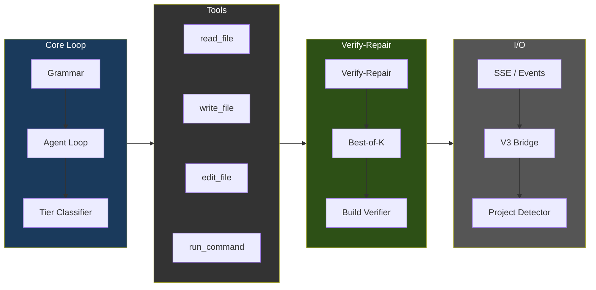

### Agent Loop Flow

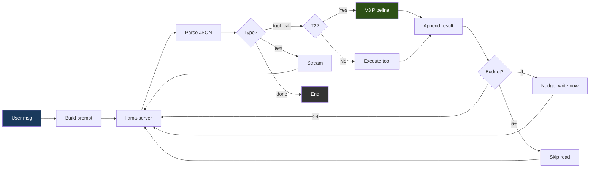

### Grammar Enforcement

llama-server's `response_format: {"type": "json_object"}` forces every model output to be exactly one of three valid JSON shapes:

```json
{"type": "tool_call", "name": "<tool_name>", "args": {...}}
{"type": "text", "content": "<message>"}
{"type": "done", "summary": "<summary>"}
```

The JSON schema uses `oneOf` with `additionalProperties: false` and enumerates tool names from the registry. The model cannot produce invalid JSON — token generation is grammar-constrained at the llama-server level.

### Tools

13 tools registered in `proxy/tools.go`:

| Tool | Purpose | Read-only |
|------|---------|-----------|
| `read_file` | Read file contents (with optional offset/limit) | Yes |
| `write_file` | Create a NEW file (rejected for existing files >5 lines — see safety limits) | No |
| `edit_file` | Surgical inline string replacement (old_str/new_str) for ≤10-line changes | No |
| `ast_edit` | Whole-function/class/HTML-element rewrite via tree-sitter selector (`function:NAME`, `class:NAME`, `<tag>`); REQUIRED over edit_file for whole-node swaps. GH #39, .py/.html/.htm only in v1 | No |
| `delete_file` | Delete file or empty directory (forces loop exit after) | No |
| `find_file` | Regex search by file **name** / path (cheap existence + locate). Distinct from `search_files` which greps inside file contents. PC-028 | Yes |
| `search_files` | Regex search across file contents (max 200 matches, skips .git/node_modules) | Yes |
| `list_directory` | List directory contents with type and size | Yes |
| `run_command` | Execute shell command via sandbox container (PC-188); 5 min timeout cap | No |
| `run_background` | PC-196 — start a long-running process (e.g. `python app.py`) in the sandbox; returns a `job_id` immediately | No |
| `tail_background` | PC-196 — fetch new stdout/stderr from a backgrounded job by `job_id` | Yes |
| `stop_background` | PC-196 — SIGTERM/SIGKILL a backgrounded job by `job_id` | No |
| `plan_tasks` | Decompose work into parallel tasks with dependencies | No |

### Tool-selection bias mitigations (May 2026 BiasBusters synthesis)

Qwen3.5-9B has a documented bias toward `edit_file` over `ast_edit` even
when ast_edit is correct (BiasBusters arxiv 2510.00307 — embeddings of
nearby tool names compete; descriptions matter more than names). Four
defenses compose in the proxy:

1. **Description rewrite** (`proxy/tools.go`). edit_file's description
   warns against whole-file/whole-function use; ast_edit's description
   says REQUIRED for >10-line / whole-node swaps; write_file's says
   NEW files only.
2. **Conditional GBNF grammar** (`proxy/grammar.go`,
   `proxy/agent.go:stepExclusions`). When a write_file is rejected on
   an existing .py/.html/.htm file >5 lines, the next LLM call is
   constrained by a GBNF grammar that bans edit_file and write_file
   from the tool-name production. The model physically cannot emit
   them. Restriction expires after one decision.
3. **Per-step tool-list filter** (same trigger). An ephemeral
   `[system note]` user message is injected reminding the model that
   ast_edit is the only structural-edit tool for this step.
4. **ASA steering vectors** (`geometric-lens/asa_calibration/`).
   Activation steering shifts the residual-stream distribution upstream
   so ast_edit is preferred even on first-attempt decisions before any
   rejection has fired. Auto-loaded by `inference/entrypoint-v3.1-9b.sh`
   from `/models/ast_edit_steering.gguf` if the file exists — always-on
   once the operator has built and dropped the vector via the workflow
   in `geometric-lens/asa_calibration/README.md`. Override path/scale/
   layer-range via `ATLAS_CONTROL_VECTOR*` env vars.

   **Per-model coupling (PC-061, V3.1.2).** Each ASA vector is trained
   against a specific model's residual-stream geometry. The shipped
   `ast_edit_steering.gguf` is calibrated for Qwen3.5-9B (4096-dim, 36
   layers) — swap in a different model and the vector is at best a no-op
   and at worst an active mis-steer. `atlas asa check` probes the configured
   vector vs the loaded model's embedding dim, parses the GGUF metadata for
   layer count + `model_hint`, and reports `compat` / `needs-build` /
   `incompatible`. `atlas asa build` wraps the calibration workflow into
   one CLI invocation that runs inside the lens container (which has the
   PC-202 hidden-states client). `atlas asa publish` ships trained
   artifacts to HF and generates a registry-PR — parallel to the
   `atlas lens` family added in PC-057/058/059. See [CLI.md § atlas asa](CLI.md#atlas-asa-pc-061).

All four mitigations compose: ASA biases the proposal distribution
upstream (item 4), grammar is a hard ban after rejection (item 2),
the system note keeps the model's working palette focused (item 3),
and descriptions provide the always-applicable steering signal in the
prompt itself (item 1).

### Per-File Tier Classification

Each `write_file`/`edit_file` call is classified independently:

| Tier | Max Turns | Action |
|------|-----------|--------|
| T0 (Conversational) | 5 | Text response only |
| T1 (Simple) | 0 (uncapped) | Direct write — no V3 overhead |
| T2 (Feature) | 0 (uncapped) | V3 pipeline fires |
| T3 (Hard) | 0 (uncapped) | V3 pipeline fires |

The May 2026 hardening sweep removed the `absoluteMaxTurns` ceiling and dropped the per-tier T1/T2/T3 caps to zero ("uncapped") because the 8-detector stack inside the loop now decides when to break: lens regression (`agent_lens_intervention`), reasoning repetition (`agent_reasoning_intervention`), tool-call repetition (`agent_repeat_intervention`), path-aware error breaker, done-without-action gate, claim-check gate, plan adherence threshold, and the empty-response fallback. Operators can still override with `ATLAS_MAX_TURNS=<n>` for one-off "fix the entire app" prompts — see `proxy/types.go::envOverrideMaxTurns`.

Classifier in `proxy/tools.go:1721+` (`classifyFileTier`); logic-pattern matcher in `tools.go:1874+` (`hasLogicIndicators`).

**Always T1 (direct write):**
- Config files by name (29 total in code): `package.json`, `tsconfig.json`, `next.config.{js,ts,mjs}`, `tailwind.config.{ts,js}`, `postcss.config.{js,mjs}`, `vite.config.{ts,js}`, `.eslintrc.json`, `.prettierrc`, `jest.config.{ts,js}`, `cargo.toml`, `go.mod`, `go.sum`, `makefile`, `cmakelists.txt`, `pyproject.toml`, `setup.py`, `setup.cfg`, `requirements.txt`, `pipfile`, `.editorconfig`, `.gitignore`, `dockerfile`, `docker-compose.{yml,yaml}`
- Data files by extension: `.json`, `.yaml`, `.yml`, `.toml`, `.csv`, `.xml`, `.env`
- Style files: `.css`, `.scss`, `.less`
- Documentation: `.md`, `.txt`, `.rst`
- Shell scripts: `.sh`, `.bash`
- Trivially-tiny files: under **10 lines** (V3 has nothing to meaningfully diversify on at that size — the prior 50-line floor was too conservative; a 33-line flask `app.py` with 7 routes is exactly the case V3 should help with)
- Unknown extensions with no logic indicators

**T2 (V3 pipeline)** — file qualifies if it's ≥10 lines AND either:
- `hasLogicIndicators(content)` returns true — defined as **2+ matches** (lowered from 3 because small-but-routed files were slipping through) across these pattern families:
  - **Function/method definitions:** `def `, `func `, `function `, `fn `, `async `
  - **Control flow:** `if `, `else `, `switch `, `match `, `for `, `while `
  - **Error handling:** `try `, `catch `, `except `, `throw `, `raise `
  - **Flask / FastAPI / Django routing:** `@app.route`, `@app.get`, `@app.post`, `@app.put`, `@app.delete`, `@blueprint`, `render_template`, `url_for`, `request.method`, `flask.`, `from flask`
  - **Express / Node API:** `export default`, `export async`, `module.exports`, `app.get`, `app.post`, `app.put`, `app.delete`, `router.`, `handler`, `NextResponse`, `Response(`, `Request`
  - **React state/data:** `useState`, `useEffect`, `useRef`, `useCallback`, `setState`, `dispatch`, `reducer`
  - **Validation:** `validate`, `schema`, `parse`, `zod.`
  - **Database:** `query(`, `insert(`, `.select(`, `.update(`
  - **JSX / React component patterns:** `return (`, `return <`, `className=`, `onClick`, `onChange`, `onSubmit`, `.map(`, `.filter(`, `.reduce(`
  - **Imports:** `import {`
- OR the file has a recognized source-code / markup extension and no logic indicators fired — gets the benefit of the doubt at T2 (covers minimal-but-real files like a 12-line component shell). Extensions: `.py`, `.go`, `.rs`, `.ts`, `.tsx`, `.js`, `.jsx`, `.c`, `.cpp`, `.cc`, `.h`, `.hpp`, `.java`, `.kt`, `.swift`, `.rb`, `.php`, `.vue`, `.svelte`, `.html`, `.htm`

**T3 (Hard)** — currently classifier never emits T3 by itself; the cyclomatic-complexity refiner (`refineTierWithCC` via GH #39 point 2's `/internal/cyclomatic_complexity`) can *escalate* T2 → T3 when McCabe CC indicates real branching density. Never downgrades.

### Plan Mode (per-turn pre-flight)

Plan mode is a planning step that runs once per agent turn **before** the first tool call. The planner samples 3 candidate plans from the LLM at different temperatures, scores each heuristically, and picks the best. The winning plan goes into the system prompt and seeds an adherence gate that auto-revises when the model thrashes off-plan.

Designed to address two failure modes:

1. **Discovery thrashing.** Without a plan, the first 2–4 tool calls are often `read_file → list_directory → search_files → read_file → …` — exploring instead of acting. With a plan, the system prompt tells the model explicitly: read this, edit that, verify with curl.
2. **No-evidence `done`.** The plan's `verify_step` is the proof-of-fix. The verification gate (PC-179) refuses `done` until that step has run successfully.

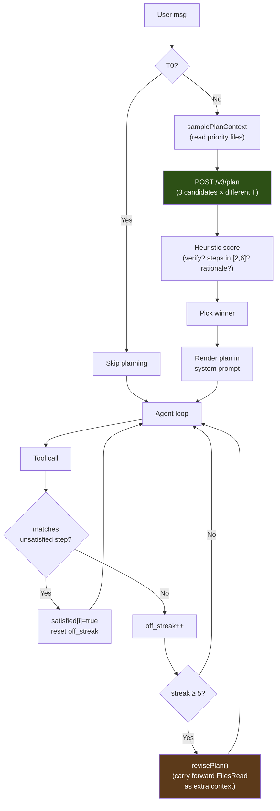

**v3-service `/v3/plan` (Python).** `v3-service/main.py` renders `PLAN_PROMPT_TEMPLATE` with the user message + working dir + truncated priority files, then calls the LLM 3× with seed offsets and temperatures `[0.3, 0.5, 0.7]`. The default mode sends `chat_template_kwargs: {enable_thinking: false}` to llama-server because Qwen3.5 routes its `<think>` block into `delta.reasoning_content` (which the chat-completions consumer doesn't see) when thinking is on, so a 2048-token budget burns entirely on reasoning with zero JSON emitted. The `/nothink` directive in the prompt alone is unreliable. Set `ATLAS_PLAN_THINKING=1` to flip both: thinking enabled, planner budget bumped to 8192 tokens (PC-206 — only useful on fast hardware; on tight GPUs planner latency goes from ~5-30 s to >4 min per candidate). Each raw response is parsed with a markdown-fence-tolerant + brace-depth-aware extractor (`_parse_plan_json`), then scored with `_score_plan`:

- **+0.3** for having a `verify_step`
- **+0.2** for `len(steps) ∈ [2, 6]`
- **+0.2** if the verify step references a known verification command (`pytest`, `python`, `curl`, `go test`, …)
- **+0.1 per step** targeting a file the user named (capped at +0.2)
- **+0.1** for a non-empty `rationale`

Highest score wins; ties go to fewer steps (less waffle). If all 3 candidates fail to parse, the handler returns a one-step fallback (`{action: "investigate the request and act"}`) so the agent loop never blocks on planner failure. API contract: [API.md § POST /v3/plan](API.md#post-v3plan).

**Proxy components (Go).**

| File | Role |
|---|---|
| `proxy/v3_bridge.go` | `callV3PlanStreaming(v3URL, req, onProgress)` — opens the SSE stream, forwards progress events to the callback, returns the final `Plan` from the `event: result` frame |
| `proxy/types.go` | `V3PlanRequest`, `Plan`, `PlanStep` types. `AgentContext` gains `Plan`, `PlanStepsSatisfied[]`, `PlanOffStreak`, `PlanRevisions` |
| `proxy/agent.go` | `samplePlanContext()` walks priority files (`app.py`, `templates/index.html`, `package.json`, …) for the planner. `shouldGeneratePlan()` gates on tier + message length. `generatePlan()` runs the bridge and emits `plan_loaded` with the full step list |
| `proxy/plan_adherence.go` | `matchPlanStep()` (loose tool-name + path-suffix match), `recordPlanAdherence()` (per-tool-call accounting), `revisePlan()` (regenerate with `FilesRead` carried forward as extra context) |

System-prompt rendering happens in `buildSystemPrompt` under a `## Plan` heading. Each step is `i. [marker] **action** target — why`, with `marker = " "` for normal steps and `marker = "✓"` for the verify step. The verify step is flagged as the "evidence-of-fix" step that the verification gate guards against `done`. (The TUI's chat-row rendering in `tui/plan.go` uses richer glyphs — ☐ unsatisfied, ✓ satisfied, ⚐ verify-step — but those live in the client, not the system prompt the model sees.)

**Tunables.**

| Constant | Source | Default | Rationale |
|---|---|---|---|
| `planAutoReviseThreshold` | `proxy/plan_adherence.go` | `5` | Off-plan tool calls before auto-revise fires |
| `planMaxRevisions` | `proxy/plan_adherence.go` | `2` | Cap on auto-revisions per loop. Past this, `revisePlan` is a no-op — the last successful plan stays active and adherence accounting continues, but no further re-planning fires. |
| `n_candidates` | `v3-service/main.py` | `3` | Diverse sampling at temps `[0.3, 0.5, 0.7]`; more candidates → more wall time (~5 s/candidate) |
| `max_tokens` per candidate | `v3-service/main.py` | `2048` | Covers a 6-step plan with rationale; 1024 truncated mid-JSON in early testing |

**Skip conditions** (`shouldGeneratePlan`):

1. `ctx.Tier == Tier0Conversational` — trivial chat ("hi", "thanks") never plans.
2. `len(message) < 12` — short acks ("yes do it", "looks good") that depend on the prior turn's plan don't plan again.

Outside those, every turn plans. Failures (`/v3/plan` 5xx, network error, all candidates unparseable beyond the fallback) degrade silently — the loop runs without `ctx.Plan`, identical to behaviour before plan mode was introduced.

**Cost.** Wall time ~15 s for a 3-candidate sweep on a warm GPU (~5 s per candidate). Token cost ≈ 1500 tokens/candidate × 3 = ~4500 actual tokens (budgeted 6144). Both are paid up front before the agent's first tool call. Recovered the moment the model skips a useless discovery round, since each saved tool call is its own ~5–10 s LLM round-trip plus tool execution.

### Safety Limits

| Limit | Value | Purpose |
|-------|-------|---------|
| Conversation trim | When `len(ctx.Messages) > 12`, trim to system + most-recent-user-instruction + last 8 (≈10 messages). Pinning the most-recent user (not the first) is critical — long agent loops push the original task beyond a "keep first user" window and the model goes generic | Prevent context overflow |
| write_file for existing files | Reject if file > 5 lines (PC-159 hardened); on .py/.html/.htm the rejection text + per-step grammar gate steers to `ast_edit` | Forces ast_edit (whole node) or edit_file (surgical) for targeted changes |
| /workspace phantom-dir gate | run_command + run_background reject commands referencing `/workspace` when that's not the project root | Catches Qwen3.5's training-data prior toward `/workspace` as a generic sandbox path; rejection names the actual workingDir so the model can self-correct in one round-trip |
| ast_edit `<html>` doctype strip | Detects `<!DOCTYPE>` at start of `content` when selector is `<html>` and strips it before write | Prevents duplicated doctype on disk — `<html>` selector replaces only the `<html>` element, not the preceding doctype |
| Suspicious-shrinkage guard | ast_edit + edit_file reject when `oldSize >= 100B` and `newSize < 64B` (`proxy/guardrails.go:271-281::validateNotSuspiciouslyShrunk`). Threshold history: v1 newSize<32B (May 9 — slipped a 32B stub), v2 newSize<128B (false-rejected a legit 80B one-liner refactor), v3 newSize<64B (current). | Catches the May 9 2026 destructive-stub bug — model emits only `<!DOCTYPE html>\n` for an entire `<html>` rewrite under json_object grammar pressure, ast_edit "succeeds", file destroyed |
| ast_edit V3 routing | After AST replacement, run V3 (lens score + sandbox + repair) on the post-edit full file when file is T2+ | Mirrors edit_file's PC-042 path — without it ast_edit shipped whatever the model emitted with no quality gate |
| Truncation detection | JSON parse check on tool args | Catches truncated model output |
| Error loop breaker | 3 consecutive failures | Stops runaway failure cycles |
| Exploration budget warning | 4 consecutive read-only calls | Inject "write your changes now" |
| Exploration budget skip | 5+ consecutive read-only calls | Skip the read, return warning |
| Command stdout | 8,000 chars max | Prevent context flooding |
| Command stderr | 4,000 chars max | Prevent context flooding |
| Search results | 200 matches max | Prevent context flooding |
| File search | Skip files > 1 MB | Performance |

---

## 4. V3 Pipeline (Inner Layer)

Activates inside `write_file`/`edit_file` executors for T2+ files. The pipeline has four phases with early exits at every stage.

### Pipeline Flow

```mermaid
flowchart LR
    Entry["T2 detected"] --> Probe["Probe"] --> Score1["C(x)/G(x)"] --> SB1["Sandbox"]
    SB1 --> Pass1{"Pass?"}
    Pass1 -->|"Yes"| Done["Done"]

    Pass1 -->|"No"| PS["PlanSearch"] --> DS["DivSampling"] --> BF["BudgetForcing"] --> Build["Build Check"] --> Score2["Score K"] --> SB2["Test K"]

    SB2 --> AnyPass{"Passed?"}
    AnyPass -->|"2+"| SStar["S* Tiebreak"] --> Done
    AnyPass -->|"1"| Select["Lens Select"] --> Done

    AnyPass -->|"0"| FA["Failure Analysis"] --> PRCOT["PR-CoT"]
    PRCOT --> PRPass{"Pass?"}
    PRPass -->|"Yes"| Done
    PRPass -->|"No"| Refine["Refinement"]
    Refine --> RefPass{"Pass?"}
    RefPass -->|"Yes"| Done
    RefPass -->|"No"| Derive["Derivation"] --> Done

    style Entry fill:#1a3a5c,color:#fff
    style Done fill:#333,color:#fff
    style Probe fill:#1a3a5c,color:#fff
    style PS fill:#1a3a5c,color:#fff
    style DS fill:#1a3a5c,color:#fff
    style BF fill:#1a3a5c,color:#fff
    style SStar fill:#2d5016,color:#fff
    style Select fill:#2d5016,color:#fff
    style Score1 fill:#2d5016,color:#fff
    style Score2 fill:#2d5016,color:#fff
    style SB1 fill:#2d5016,color:#fff
    style SB2 fill:#2d5016,color:#fff
    style Build fill:#2d5016,color:#fff
    style PRCOT fill:#5c3a1a,color:#fff
    style Refine fill:#5c3a1a,color:#fff
    style Derive fill:#5c3a1a,color:#fff
    style FA fill:#5c3a1a,color:#fff
```

Legend: blue = generation, green = verification/selection, brown = repair.

### Phase Details

**Phase 0: Probe** generates a single baseline candidate with progressive retry (light → standard → /nothink). Scored with C(x)/G(x) and tested in sandbox. If it passes, pipeline exits immediately.

**Phase 1: Constraint-Driven Generation**

- **PlanSearch** generates 3 structurally different implementation plans by extracting distinct constraint sets
- **DivSampling** applies perturbation diversity: 4 roles (competitive_programmer, systems_engineer, mathematician, pragmatist) + 4 instructions (step_by_step, edge_case_first, complexity_aware, constraint_driven) + 4 styles (functional, pythonic, optimize_iteratively, structured)
- **Budget Forcing** controls thinking token allocation:

| Tier | Thinking Tokens | Wait Injection |
|------|----------------|----------------|
| nothink | 0 | /nothink prompt |
| light | 1,024 | None |
| standard | 2,048 | If thinking ends < 512 tokens |
| hard | 4,096 | If thinking ends < 1,024 tokens |
| extreme | 8,192 | If thinking ends < 2,048 tokens |

Wait injection appends "Wait, let me reconsider.\n" to force longer thinking. Tier selection driven by C(x) energy.

**Phase 2: Verification and Selection**

- **Build Verification**: Python (`py_compile`), TypeScript (`tsc --noEmit`), JavaScript (`node --check`), Go (`go build`), Rust (`cargo check`), C/C++ (`gcc/g++ -fsyntax-only`), Shell (`bash -n`). Framework overrides for Next.js, React, Flask, Django, Express.
- **S* Tiebreaking** (2+ passing): generates edge-case inputs, runs both candidates, majority wins
- **Lens Selection** (1 passing or fallback): sort by C(x) energy, lowest wins

**Phase 3: Repair** (if 0/K pass) — three strategies, sequential with early exit:

- **Failure Analysis**: categorize failures (wrong_algorithm, implementation_bug, edge_case_miss, time_limit, format_error, partial_correct)
- **Metacognitive Evaluation**: inject compensating constraints from known Qwen3.5 failure patterns
- **PR-CoT**: 4 perspectives (logical_consistency, information_completeness, biases, alternative_solutions) x (analysis + repair) = ~8 LLM calls, up to 3 rounds
- **Refinement Loop**: Failure Analysis → Constraint Refinement → Code Gen → Test → Learn. 2 iterations, 120s budget, ~5+ LLM calls each. Cosine distance filtering (>= 0.15) prevents hypothesis repetition
- **Derivation Chains**: decompose into up to 5 sub-problems, sandbox-verify each, compose final. ~7+ LLM calls

### Module Map

18 Python modules in `benchmark/v3/` orchestrated by `v3-service/main.py`:

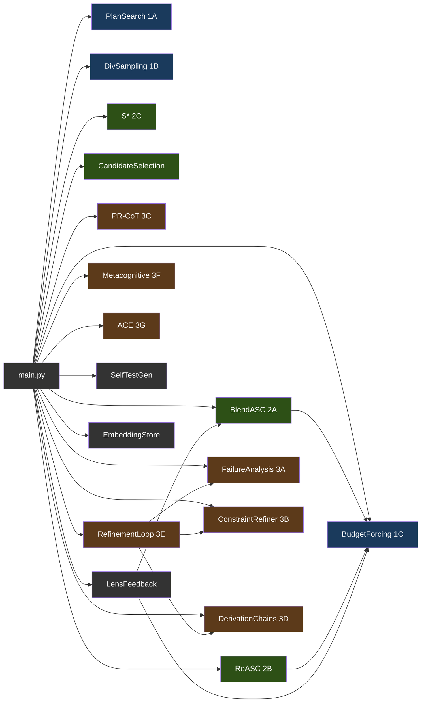

Legend: blue = Phase 1 (generation), green = Phase 2 (selection), brown = Phase 3 (repair), gray = utilities.

---

## 5. Geometric Lens

Neural scoring system that evaluates code quality without executing it by analyzing the geometric structure of model embeddings. Runs entirely on CPU. Also serves as the RAG API for project indexing, retrieval, confidence routing, and pattern caching.

#### Why "Geometric Lens"?

The core idea behind the Geometric Lens comes from a simple premise: stop scaling models and start wrapping them in intelligent infrastructure. Jose Crespo's ["Everyone's Wrong About AI Programming"](https://www.josecrespophd.org/p/everyones-wrong-about-ai-programming) argues that AI-generated code drifts toward errors because current LLMs operate in flat embedding spaces where correct and incorrect code paths cost the same. The solution is to build an energy landscape around the model where correct code is "downhill" and incorrect code is "uphill."

Anthropic's [Manipulating Manifolds](https://transformer-circuits.pub/2025/linebreaks/index.html) research provides evidence that transformers already create manipulable geometric structures in their embedding space - the raw material is already there. Bar et al.'s [Geometric Unification of Generative AI](https://arxiv.org/html/2510.00666v1) formalizes how distance functions on data manifolds can be learned and used for scoring.

ATLAS implements this with two complementary models. C(x) is a learned energy function (4096-to-512-to-128-to-1 MLP) over the model's own embeddings. Each code candidate gets embedded by llama-server, and C(x) scores where it sits in that geometry. Low energy means the candidate clusters with known-correct code. High energy means it clusters with known-incorrect code. No external oracle, no execution required - just the geometry of the model's own representations.

G(x) is the metric tensor - a diagonal tensor in PCA-reduced embedding space that captures how the energy landscape curves in different directions. Where C(x) answers "how good is this candidate?", G(x) answers "which direction should we move to improve it?" The correction engine uses G(x) to compute geometry-aware gradient steps (`-α · G⁻¹ · ∇C`), steering candidates downhill toward correctness along the natural curvature of the manifold rather than taking naive gradient steps. G(x) is implemented and deployed (shipped in V3.0.1, still active in V3.1.0).

### Scoring Models

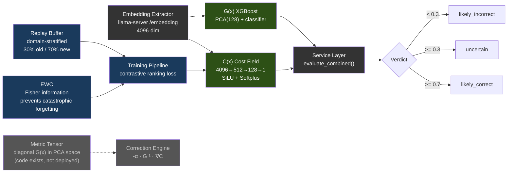

| Model | Architecture | Training Data | Performance |
|-------|-------------|---------------|-------------|
| **C(x)** | 4096→512→128→1 MLP (SiLU, Softplus) | 597 LCB embeddings (504 PASS, 93 FAIL) | Val AUC 0.9467, sep 2.04x |
| **G(x)** | PCA(4096→128) + XGBoost | 13,398 embeddings (4,835 PASS, 8,563 FAIL) | PCA 80.8% variance |

C(x) normalization: `1 / (1 + exp(-(energy - 19.0) / 2.0))` → [0, 1]. Parameters: 2,163,457 — `cost_field.pt` is **8.3 MiB on disk** (8.65 MB decimal). Math: 4096·512+512 + 512·128+128 + 128·1+1 = 2,163,457 × 4B float32 = 8.25 MiB.

> **Note:** Model weights (.pt, .pkl files) are not committed to the repository — they are built during training and baked into the container image or mounted at runtime. When model files are absent, the service degrades gracefully: C(x) returns neutral energy, G(x) returns `gx_score: 0.5` and `verdict: "unavailable"`. Training data and weights are available on [HuggingFace](https://huggingface.co/datasets/itigges22/ATLAS).

### RAG / PageIndex V2

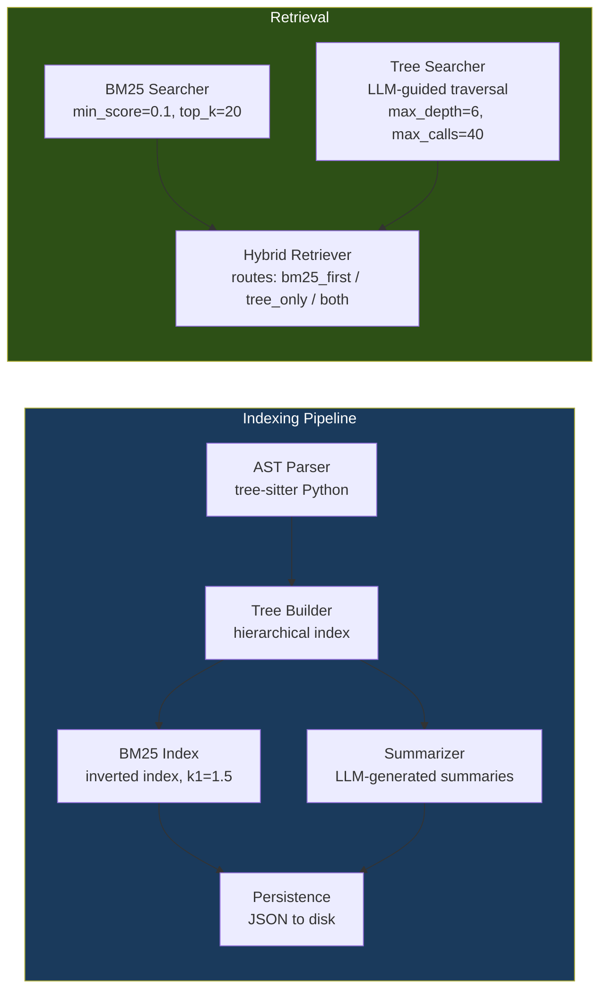

### Confidence Router & Pattern Cache

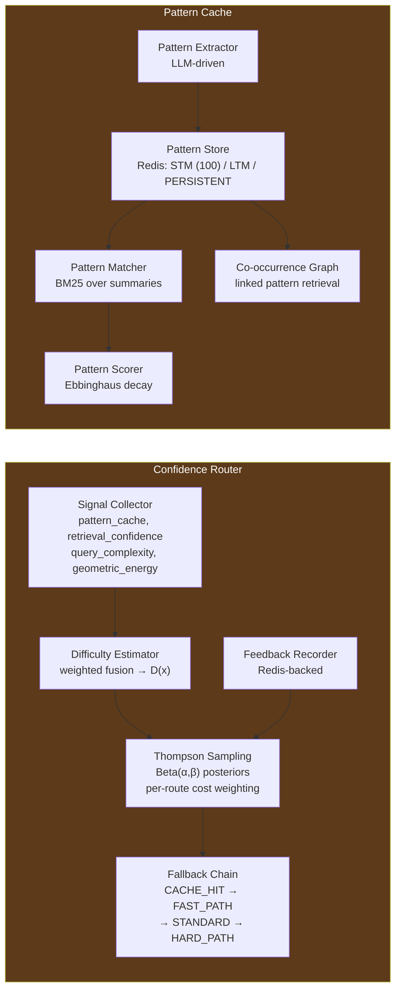

4 routes with cost-weighted Thompson Sampling: CACHE_HIT (cost=1, k=0) → FAST_PATH (cost=50, k=1) → STANDARD (cost=300, k=5) → HARD_PATH (cost=1500, k=20).

---

## 6. Sandbox

Isolated code execution with compilation, testing, and linting.

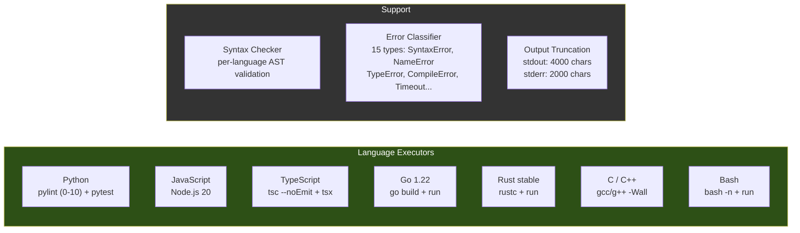

Language aliases accepted: `py`/`python3` (Python), `js`/`node` (JavaScript), `ts` (TypeScript), `golang` (Go), `rs` (Rust), `c++` (C++), `sh`/`shell` (Bash). Max execution time: 60s. Max memory: 512 MB. Two workspace paths: **`/execute`** (V3 candidate-test path) uses an ephemeral scratch dir under `/tmp/sandbox` (tmpfs); **`/shell`** (the agent's `run_command` route per PC-188, plus `/jobs/*` for background processes) runs against `/workspace` — the bind-mounted project root from `ATLAS_PROJECT_DIR` (Docker) or hostPath `${ATLAS_PROJECTS_DIR}` (K3s), the same path the proxy sees.

---

## 7. VRAM Budget

Running on RTX 5060 Ti 16GB with Docker Compose defaults (32K context):

| Component | VRAM |
|-----------|------|
| Qwen3.5-9B-Q6_K model weights | ~6.9 GB |
| KV cache (32K context) | ~1.3 GB |
| **Total llama-server** | **~8.2 GB** |
| Geometric Lens | 0 (CPU-only, ~12 MB RAM for models, ~128 MB for PyTorch runtime) |
| v3-service | 0 (CPU-only) |
| sandbox | 0 (CPU-only) |
| atlas-proxy | 0 (Go binary, ~30 MB RAM) |
| **Free VRAM** | **~7.8 GB** |

All computation outside of llama-server runs on CPU. The GPU is used exclusively for LLM inference and embedding extraction.

### 7.1 VRAM Budget per Backend

The 8.2 GB / 7.8 GB-free split above is the NVIDIA RTX 5060 Ti 16GB baseline. Other backends differ structurally:

| Backend | Reported "VRAM" | Realistic budget under load | Notes |
|---|---|---|---|
| **CUDA** (dedicated VRAM) | Hardware spec (16 GB on the canonical 5060 Ti) | ~95% of spec (driver reserves ~500 MB) | The numbers in the table above apply directly. |
| **ROCm** (dedicated VRAM) | Hardware spec | ~90–95% of spec (HIP runtime slightly heavier than CUDA's) | RX 7900 XTX (24 GB) → comfortably runs 14B Q5 + 32K context with 2 parallel slots. |
| **Metal** (Apple unified) | Total system RAM | **~70%** of system RAM | OS + browser + IDE eat ~30%. A 16 GB MBP has a *realistic* 11 GB budget — too tight for Qwen3.5-9B Q6_K (7.5 GB + 2-4 GB KV cache). Use Q4_K_M (5 GB) on ≤16 GB; Q6_K wants ≥24 GB unified. |
| **SYCL** (Intel Arc) | Hardware spec | Unknown — TBD when shipped | A770 (16 GB) target is conservative-equivalent to NVIDIA 16 GB. |

---

## 8. Deployment

### 8.1 Docker Compose — NVIDIA (default)

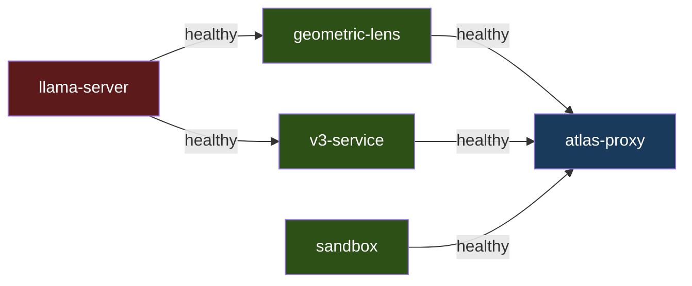

`llama-server` and `sandbox` start independently (no dependencies). `geometric-lens` and `v3-service` wait for `llama-server` to be healthy. `atlas-proxy` waits for all four services. First run builds container images (several minutes); subsequent starts are fast. Bring up with the standard `docker compose up -d` — the base `docker-compose.yml` declares the `driver: nvidia` GPU reservation, which works via `nvidia-container-toolkit` on the host.

### 8.2 Docker Compose — AMD ROCm (V3.1.1)

Same service graph as 8.1, but bring up with the ROCm override layered on top:

```bash
docker compose -f docker-compose.yml -f docker-compose.rocm.yml up -d
```

The override (`docker-compose.rocm.yml`) does three things:
1. Switches `llama-server`'s image to `atlas-llama-rocm` and its build to `Dockerfile.rocm` (HIP backend, default fat build covering RDNA3/RDNA2/CDNA2).
2. Uses `!reset []` to clear the NVIDIA `deploy.resources.reservations.devices` block from the base file, then adds `/dev/kfd` + `/dev/dri` device passthrough.
3. Adds `group_add: [video, render]` so the container can access the ROCm devices.
4. Forces `ATLAS_BACKEND=rocm` in the container env so the entrypoint takes the HIP-tuning branch.

`atlas-bootstrap.sh` and `atlas init` both auto-detect AMD GPUs and use the override transparently; manual users just supply both `-f` flags.

ROCm has no separate container runtime equivalent to `nvidia-container-toolkit` — passthrough alone is enough, simplifying the install surface. See SETUP.md for host prereqs (amdgpu-dkms kernel driver, `render` + `video` groups).

### 8.3 Bare Metal

The `atlas` CLI (`pip install -e .`) talks directly to services on their default ports. The bash launcher script can start all services as local processes and launch the atlas-tui front-end, or detect a running Docker Compose stack and connect to it. Bare-metal works on any backend (NVIDIA, ROCm, Metal) as long as a llama-server binary built against the right backend is on `PATH`.

### 8.4 macOS Native (V3.1.2 planned)

macOS does not support GPU passthrough to Docker containers, so the Compose path doesn't apply. The V3.1.2 release will document a native install:

- **llama-server**: `brew install llama.cpp` (Metal-built binary from Homebrew) or `make -j LLAMA_METAL=1` from source.
- **Python services** (v3-service, geometric-lens, sandbox): `uv venv && uv pip install -e .` against the host Python, with `PyTorch` from the macOS wheel index.
- **atlas-proxy**: cross-compiled Go binary, distributed as part of the macOS install bundle.
- **Models**: 16 GB MBPs use Q4_K_M (~5 GB) by default to fit unified-memory budget; ≥24 GB MBPs can run Q6_K like the Linux default.
- **No Docker, no Compose, no override files** — `atlas init` writes a different `.env` that the macOS-specific launcher consumes.

ATLAS_BACKEND=metal already triggers `atlas init` to refuse with a "V3.1.2 planned" message in V3.1.1 — better to block early than write a `.env` Docker can't honor.

### 8.5 K3s

Manifests in `templates/*.yaml.tmpl` are rendered into `manifests/*.yaml` by `scripts/generate-manifests.sh` (or `install.sh`'s `process_templates` step) using `envsubst` against `atlas.conf`. Services deploy as Pods in the `atlas` namespace; external access is via NodePort (`ATLAS_PROXY_NODEPORT`, `ATLAS_LLAMA_NODEPORT`, `ATLAS_LENS_NODEPORT`, `ATLAS_SANDBOX_NODEPORT`, `ATLAS_V3_NODEPORT`). The K3s entrypoint is the same `inference/entrypoint-v3.1-9b.sh` used under Docker Compose — context size, KV cache quantization, flash attention, and mlock are all driven by env vars (`ATLAS_CONTEXT_LENGTH`, `ATLAS_FLASH_ATTENTION`, etc.) so behavior is identical across deployment modes. The proxy and sandbox Pods both `hostPath`-mount `${ATLAS_PROJECTS_DIR}` at `/workspace` so the agent's tool calls see the same files in both Pods.

`scripts/deploy-9b.sh` accepts `--backend cuda|rocm` (or `ATLAS_BACKEND` env) to deploy either image with the appropriate env-var set. ROCm K8s pods additionally need `/dev/kfd` + `/dev/dri` hostPath mounts and `render`/`video` group membership in their Pod spec — the manifest templates for this are V3.1.2 work; the env-var patch alone isn't sufficient for a working ROCm K3s deployment.

---

## 9. Data Flow

### T1: Simple File Write

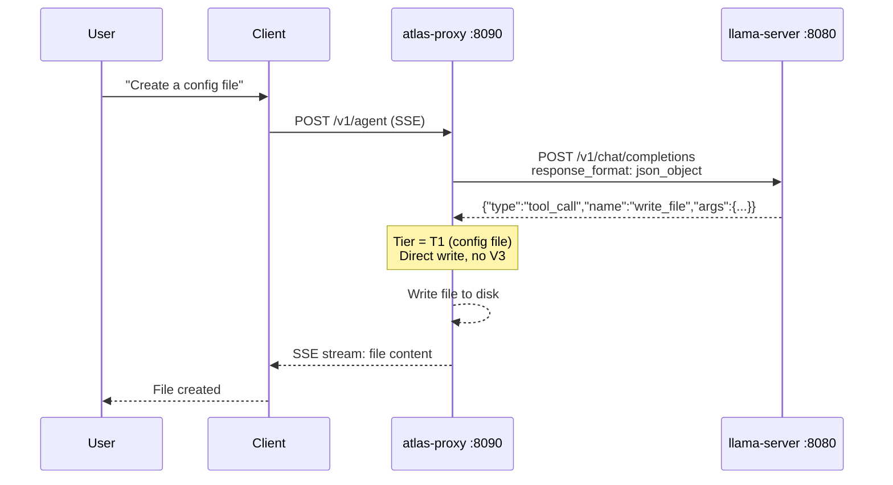

One LLM call. No V3 overhead.

### T2: Feature File Write

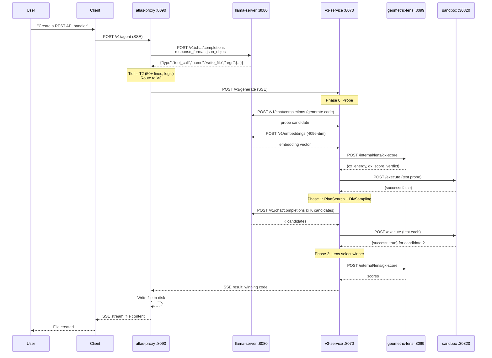

Minimum 3 llama-server calls (1 probe generation + 1 self-test generation + 1 embedding extraction). Maximum 30+ if Phase 3 repair engages all strategies.

### Edit Existing Code

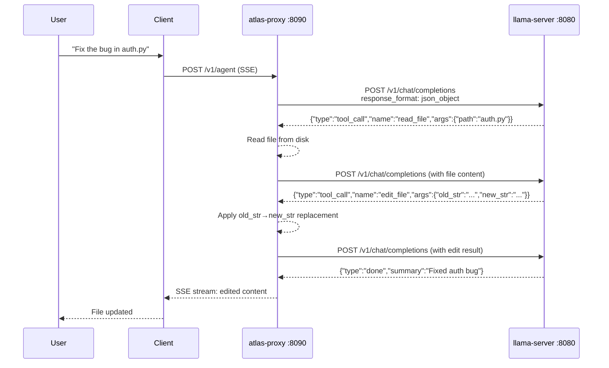

Existing files over 5 lines are rejected for `write_file` — the model must use `edit_file` (surgical, ≤10 lines) or `ast_edit` (whole-node rewrite, .py/.html/.htm only). On `.py`/`.html`/`.htm` files, the per-step grammar gate (BiasBusters #2) actively bans `edit_file`/`write_file` from the tool-name production for the next decision so the model can't relapse to the wrong shortcut.
